# Fortiadc Kubernetes Controller
Below content is the basic know-how and quick start for FortiADC Kubernetes Controller.
For more much details, please refer to the official document.

[FortiADC Kubernetes Controller for Kubernetes clusters and OpenShift](https://docs.fortinet.com/product/fortiadc-kubernetes-controller)

</br>
</br>
</br>


The FortiADC Kubernetes Controller manages both standard Kubernetes Ingress resources and Fortinet-defined custom resources (such as VirtualServer, RemoteServer, and Host). It enables you to control FortiADC configurations directly from within Kubernetes. The controller runs as a container within a pod deployed in your Kubernetes cluster. The list below outlines the major functionalities of the FortiADC Kubernetes Controller: 

 - To list and watch Ingress/Custom resource related resources, such as Ingress, VirtualServer, RemoteServer, Host, Service, Node, Pod and Secret. 
 - To convert Ingress/Fortinet-defined custom resources related resources to FortiADC objects, such as virtual server, content routing, real server pool, and more.
 - To handle Add/Update/Delete events for watched Ingress/Fortinet-defined custom resources and automatically implement corresponding actions on FortiADC.


 

The FortiADC Kubernetes Controller integrates Kubernetes native routing with FortiADC’s advanced traffic management and security features like WAF, antivirus scanning, and DoS protection—helping secure web services inside the cluster.

The VirtualServer custom resource (v1alpha2) extends the standard Ingress by supporting both Layer 7 (HTTP/HTTPS) and Layer 4 (TCP/UDP) traffic, and allows detailed configuration of FortiADC virtual server features.

The RemoteServer and Host custom resource allow detailed configuration of FortiADC GLB features. The RemoteServer supports managing both FortiADC instances and third-party servers. The Host provides a DNS-based solution to distribute network traffic to multiple servers across geographic regions.

Additional features such as health checks, traffic log management, and FortiView enhance visibility and manageability of both Ingress and VirtualServer resources.


## Supported Release and Version

<table>
    <thead>
        <tr>
            <th>Product</th>
            <th colspan=9>Version</th>
        </tr>
    </thead>
    <tbody>
        <tr>
            <td>FortiADC Ingress Controller</td>
			<td>1.0.0</td>
			<td>1.0.1</td>
			<td>1.0.2</td>
			<td>2.0.0</td>
			<td>2.0.1</td>
			<td>2.0.2</td>
			<td>2.0.3</td>
			<td>3.0.0</td>
			<td>3.1.0</td>
        </tr>
        <tr>
            <td>Kubernetes</td>
            <td>1.19.8-1.23.x</td>
            <td>1.19.8-1.24.x</td>
            <td colspan=2>1.19.8-1.27.x</td>
            <td>1.19.8-1.28.x</td>
            <td>1.19.8-1.30.x</td>
			<td>1.19.8-1.32.x</td>
			<td>1.19.8-1.33.x</td>
			<td>1.19.8-1.34.x</td>
        </tr>
        <tr>
            <td>FortiADC</td>
            <td colspan=9>5.4.5 - 8.x.x*</td>
        </tr>
            <tr>
            <td>Openshift Container platform</td>
            <td colspan=3>Not supported</td>
            <td colspan=2> 4.7-4.12.x</td>
            <td colspan=4> 4.13-4.19.x</td>
        </tr>
    </tbody>
</table>

>[!NOTE]
>Some features of the FortiADC Kubernetes Controller require a corresponding version of FortiADC support. Please check the [release notes](https://github.com/hshaocheng/fortiadc-kubernetes-controller/blob/main/Release-Notes.md).

>[!WARNING]
>When using FortiADC Kubernetes Controller 2.0.x, the Ingress related objects on FortiADC (including virtual servers, content routing, real server pools, and real servers) will be fully managed by the Ingress Controller. This means that any virtual server, content routing, real server pool or real server object that is not deployed by FortiADC Ingress Controller will be removed automatically.

## Supported Environment
The FortiADC Kubernetes Controller has been verified to run in the Openshift Cluster in Openshift Container Platform environment and Kubernetes cluster in the below environments:
| Environment | Tools for Building |
|--|--|
| Private Cloud | kubeadm, minikube, microk8s |
| Public Cloud | AWS EKS, Oracle OKE |

## The Kubernetes API Version

To ensure you use an API version of Kubernetes objects that the FortiADC Kubernetes Controller supports, you can use the kubectl command to check the resource API version.


    for kind in `kubectl api-resources | tail +2 | awk '{ print $1 }'`; do kubectl explain $kind; done | grep -e "KIND:" -e "VERSION:"

| API Object | API Version |
|--|--|
| Node | v1 |
| Pod | v1 |
| PodTemplate | v1 |
| ServiceAccount | v1 |
| Deployment | apps/v1 |
| ReplicaSet | apps/v1 |
| DaemonSets | apps/v1 |
| Endpoints | v1 |
| Endpointslices | discovery.k8s.io |
| Event | v1 |
|IngressClass  | networking.k8s.io/v1 |
|Ingress  | networking.k8s.io/v1 |
|ClusterRoleBinding  | rbac.authorization.k8s.io/v1 |
|ClusterRole  | rbac.authorization.k8s.io/v1 |
|RoleBinding  | rbac.authorization.k8s.io/v1 |
|Role  | rbac.authorization.k8s.io/v1 |

:warning: Starting from version 3.0.0, FortiADC Kubernetes Controller utilizes the EndpointSlice resource (discovery.k8s.io/v1) to replace the legacy Endpoints (v1) API, aligning with Kubernetes' modern service discovery mechanisms.

# Installation
Install the FortiADC Kubernetes Controller using Helm Charts.

:bulb: Currently, only Helm 3 (version 3.6.3 or later) is supported.

Helm Charts ease the installation of the FortiADC Kubernetes Controller in the Kubernetes cluster. By using the Helm 3 installation tool, most of the Kubernetes objects required for the FortiADC Kubernetes Controller can be deployed in one simple command.

To get the verbose output, add --debug option for all the Helm commands.

## Install cert-manager.io

>[!WARNING] 
> :bangbang: Webhook server is introduced in FortiADC Kubernetes Controller 3.1,  and the cert-manager is required to offer the self-signed certificate for the TLS connection between Kubernetes API server and webhook server.
>
>Please follow the cert manager installation guide to install cert manager before you install FortiADC Kubernetes Controller 3.1 or upgrade FortiADC Kubernetes Controller to version 3.1 or later.

The version of cert manager we had verified is v1.19.1

https://cert-manager.io/docs/installation/


    helm repo add jetstack https://charts.jetstack.io
    helm repo update

    helm install --devel --debug cert-manager jetstack/cert-manager \
           --namespace cert-manager \
           --create-namespace \
           --version v1.19.1 \
           --set crds.enabled=true


## Get Repo Information


    helm repo add fortiadc-kubernetes-controller https://hshaocheng.github.io/fortiadc-kubernetes-controller/

    helm repo update

## Install FortiADC Ingress Controller

    helm install --devel --debug first-release --namespace fortiadc-ingress --create-namespace --wait fortiadc-kubernetes-controller/fadc-k8s-ctrl

## Check the installation

    helm history -n fortiadc-ingress first-release

    kubectl get -n fortiadc-ingress deployments

    kubectl get -n fortiadc-ingress pods

Check the log of the FortiADC Kubernetes Controller.

    kubectl logs -n fortiadc-ingress -f [pod name]

## Upgrading chart

    helm repo update
    helm upgrade --devel --debug --reset-values -n fortiadc-ingress first-release fortiadc-kubernetes-controller/fadc-k8s-ctrl

>[!WARNING]
>Because the Helm chart repository was renamed to fortiadc-kubernetes-controller starting from version 3.0.0, if you are upgrading from a 2.x version to 3.0.0 or later, please remove the old Helm repository and add the new one before proceeding.

    helm repo remove fortiadc-ingress-controller
    helm repo add fortiadc-kubernetes-controller https://hshaocheng.github.io/fortiadc-kubernetes-controller/
    helm repo update


## Uninstall Chart

    helm uninstall -n fortiadc-ingress first-release

# Configuration parameters
## FortiADC Authentication Secret

As shown in above figure, the FortiADC Kubernetes Controller satisfies an Ingress by FortiADC REST API call, so the authentication parameters of the FortiADC must be known to the FortiADC Kubernetes Controller.

To preserve the authentication securely on the Kubernetes cluster, you can save it with the Kubernetes secret. For example

    kubectl create secret generic fad-login -n [namespace] --from-literal=username=admin --from-literal=password=[admin password]

The secret is named fad-login. This value will be specified in the Ingress annotation "fortiadc-login" for the FortiADC Kubernetes Controller to get permission access on the FortiADC.

:warning:  The namespace of the authentication secret must be the same as the Ingress which references this authentication secret.

## Annotation in Ingress
Configuration parameters are required to be specified in the Ingress annotation to enable the FortiADC Kubernetes Controller to determine how to deploy the Ingress resource.

|Parameter  | Description | Default |
|--|--|--|
| fortiadc-ip | The Ingress will be deployed on the FortiADC with the given IP address or domain name. <br> **Note**: This parameter is **required**. | |
| fortiadc-admin-port | FortiADC https service port. | 443|
| fortiadc-login | The Kubernetes secret name preserves the FortiADC authentication information. <br> **Note**: This parameter is **required**. | |
| fortiadc-vdom | Specify which VDOM to deploy the Ingress resource if vdom is enabled on FortiADC. |root |
| fortiadc-ctrl-log | Enable/disable the FortiADC Kubernetes Controller log. Once enabled, the FortiADC Kubernetes Controller will print the verbose log the next time the Ingress is updated. |enable |
| virtual-server-ip | The virtual server IP of the virtual server to be configured on the FortiADC. This IP will be used as the address of the Ingress. <br> **Note**: This parameter is **required**. | |
| virtual-server-interface | The FortiADC network interface for the client to access the virtual server. <br> **Note**: This parameter is **required**. | |
| virtual-server-port | Default is 80. <br> If TLS is specified in the Ingress, then the default is 443.|80 for HTTP service.<br> 443 for HTTPS service. |
| load-balance-method | Specify the predefined or user-defined method configuration name. For more details, see the FortiADC Handbook on load balancing methods|LB_METHOD_ROUND_ ROBIN |
| load-balance-profile| Default is LB_PROF_HTTP. <br> If TLS is specified in the Ingress, then the default is LB_ PROF_HTTPS.|LB_PROF_HTTP.<br> LB_PROF_HTTPS. |
| virtual-server-addr-type | IPv4 or IPv6. | ipv4 |
| virtual-server-traffic-group | Specify the traffic group for the virtual server. For more details, see the FortiADC Handbook on traffic groups. | default |
| virtual-server-nat-src-pool | Specify the NAT source pool. For more details, see the FortiADC Handbook on NAT source pools. | |
| virtual-server-waf-profile | Specify the WAF profile name. For more details, see the FortiADC Handbook on WAF profiles.| |
| virtual-server-av-profile | Specify the AV profile name. For more details, see the FortiADC Handbook on WAF profiles.| |
| virtual-server-dos-profile | Specify the DoS profile name. For more details, see the FortiADC Handbook on WAF profiles.| |
| virtual-server-captcha-profile | Specify the Captcha profile name. For more details, see the FortiADC Handbook on Captcha profiles. <br> **Note**: This field is available if **WAF profile** or **DoS profile** is specified. | |
| virtual-server-fortiview | Enable/disable FortiView. |disable |
| virtual-server-traffic-log | Enable/disable the traffic log. |disable |
| virtual-server-wccp | Enable/disable WCCP. For more details, see the FortiADC Handbook on WCCP.|disable |
| virtual-server-persistence | Specify a predefined or user-defined persistence configuration name. For more details, see the FortiADC Handbook on persistence rules.| |
| virtual-server-fortigslb-publicip-type | Set the Public IP type for the virtual server as either IPv4 or IPv6. | ipv4 |
| virtual-server-fortigslb-publicip | Enter the virtual server public IP address. | |
| virtual-server-fortigslb-1clickgslb |Enable/disable the FortiGSLB One Click GSLB server. |disable|
| virtual-server-fortigslb-hostname | The **Host Name** option is available if **One Click GSLB Server** is enabled. Enter the hostname part of the FQDN, such as `www`. **Note:** You can specify the @ symbol to denote the zone root. The value substitute for @ is the preceding $ORIGIN directive. | |
| virtual-server-fortigslb-domainname | The **Domain Name** option is available if **One Click GSLB Server** is enabled. The domain name must end with a period. For example,`example.com.` | |

## Annotation in Fortinet-defined CRD
Configuration parameters are required to be specified in the Fortinet-defined CRD annotation to enable the FortiADC Kubernetes Controller to determine how to deploy the VirtualServer, RemoteServer, and Host resource.

|Parameter  | Description | Default |
|--|--|--|
| fortiadc-ip | The VirtualServer/RemoteServer/Host will be deployed on the FortiADC with the given IP address or domain name. <br> **Note**: This parameter is **required**. | |
| fortiadc-admin-port | FortiADC https service port. | 443|
| fortiadc-login | The Kubernetes secret name preserves the FortiADC authentication information. <br> **Note**: This parameter is **required**. | |
| fortiadc-ctrl-log | Enable/disable the FortiADC Kubernetes Controller log. Once enabled, the FortiADC Kubernetes Controller will print the verbose log the next time the VirtualServer/RemoteServer/Host is updated. |enable |

## Annotation in Service

>**Warning**
>The FortiADC Ingress Controller version 1.0.x only supports services of type **NodePort**. 2.0.x supports both NodePort and ClusterIP type.

|Parameter  | Description | Default |
|--|--|--|
| health-check-ctrl | Enable/disable the health checking for the real server pool. |disable |
| health-check-relation | AND — All of the selected health checks must pass for the server to be considered available. <br> OR — One of the selected health checks must pass for the server to be considered available.|disable |
| health-check-list | One or more health check configuration names. Concatenate the health check names with a space between each name. For example: "LB_HLTHCK_ICMP LB_HLTHCK_HTTP". For more details, see the FortiADC Handbook on health checks. ||
| real-server-ssl-profile| Specify the real server SSL profile name. Real server profiles determine settings for communication between FortiADC and the backend real servers. The default is NONE, which is applicable for non-SSL traffic. For more details, see the FortiADC Handbook on SSL profiles. |NONE|
|overlay_tunnel|Overlay tunnel name. Used for service with ClusterIP type||

# Deployment
## Deploy Layer7 HTTP(S) Ingress/VirtualServer
Below is an example to deploy a simple-fanout Ingress/VirtualServer

 ```mermaid
graph LR;
  client([client])-.-> FortiADC_load_balancer["FortiADC load balancer"] .-> ingress["HTTP/HTTPS VirtualServer or Ingress, 172.23.133.6 (test.com)"];
  ingress-->|/info|service1[Service service1:1241];
  ingress-->|/hello|service2[Service service2:1242];
  subgraph cluster
    ingress;
    service1-->pod1[Pod];
    service1-->pod2[Pod];
    service2-->pod3[Pod];
    service2-->pod4[Pod];
  end
  classDef plain fill:#ddd,stroke:#fff,stroke-width:4px,color:#000;
  classDef k8s fill:#326ce5,stroke:#fff,stroke-width:4px,color:#fff;
  classDef cluster fill:#fff,stroke:#bbb,stroke-width:2px,color:#326ce5;
  class ingress,service1,service2,pod1,pod2,pod3,pod4 k8s;
  class client plain;
  class cluster cluster;
```

In this example, the client can access service1 with the URL https://test.com/info and access service2 with the
URL https://test.com/hello.
Service1 defines a logical set of Pods with the label run=sise. Sise is a simple HTTP web server.
Service2 defines a logical set of Pods with the label run=nginx-demo. Nginx is also a simple HTTP web server.
Services are deployed under the namespace default.

### Deploy the Pods and expose the Services

Service1:

    kubectl apply -f https://raw.githubusercontent.com/hshaocheng/fortiadc-kubernetes-controller/main/service_examples/service1.yaml
Service2:

    kubectl apply -f https://raw.githubusercontent.com/hshaocheng/fortiadc-kubernetes-controller/main/service_examples/service2.yaml

### Deploy the Ingress/VirtualServer

Download the simple-fanout-example.yaml


    curl -k https://raw.githubusercontent.com/hshaocheng/fortiadc-kubernetes-controller/main/ingress_examples/simple-fanout-example.yaml -o simple-fanout-example.yaml

Modify the Ingress Annotation in simple-fanout-example.yaml to accommodate to your environment, ex: fortiadc-ip, virtual-server-ip, etc. Then deploy the ingress with kubectl command

    kubectl apply -f simple-fanout-example.yaml

:bulb: You can use VirtualServer to replace with Ingress.

    curl -k https://raw.githubusercontent.com/hshaocheng/fortiadc-kubernetes-controller/main/customResource/virtualserver/virtualserver_simple_fanout.yaml -o virtualserver-simple-fanout-example.yaml


Modify the VirtualServer Annotation in virtualserver-simple-fanout-example.yaml to accommodate to your environment, ex: fortiadc-ip, fortiadc-admin-port, etc. Then deploy the virtualserver with kubectl command

    kubectl apply -f virtualserver-simple-fanout-example.yaml

Check the deployed Ingress/VirtualServer with FortiView


Try to access https://test.com/info.


Try to access https://test.com/hello.


## Deploy Layer4 TCP VirtualServer

Below, we will walk through the steps to deploy a TCP VirtualServer that acts as a proxy for a PostgreSQL database service running in Kubernetes.

```mermaid
flowchart LR

  subgraph "Kubernetes Cluster"
    pgsvc["PostgreSQL Service"]
    sslpg["🔒 PostgreSQL Pod<br>SSL enabled + Cert Verification"]
    pgsvc --> sslpg
  end

  client["psql client"] --> l4vs["FortiADC Layer4 TCP VirtualServer<br>(192.168.1.108:5432)"]
  l4vs --> route["Content Routing<br>sourceAddress 192.168.1.0/24"]
  route --> pgsvc
```


### Deploy the Pods and expose the Services

Download the PostgresSQL with SSL enabled service yaml file:

     curl -k https://raw.githubusercontent.com/hshaocheng/fortiadc-kubernetes-controller/main/service_examples/postgresql_ssl_service.yaml -o postgresql_ssl_service.yaml

:warning:  Please make sure you had installed the cert-manager. The certificates used in this example are all auto-signed and issued by cert-manager.

Modify the Service Annotation in postgresql_ssl_service.yaml to accommodate to your environment, ex: change the name of overlay_tunnel if your want to expose your service with ClusterIP type. Then deploy the PostgresSQL with SSL enabled service with kubectl command

    kubectl apply -f postgresql_ssl_service.yaml

### Deploy the VirtualServer

Download the virtualserver_postgres_ssl.yaml


    curl -k https://raw.githubusercontent.com/hshaocheng/fortiadc-kubernetes-controller/main/customResource/virtualserver/virtualserver_postgres_ssl.yaml -o virtualserver_postgres_ssl.yaml

Modify the VirtualServer Annotation in virtualserver_postgres_ssl.yaml to accommodate to your environment, ex: fortiadc-ip, fortiadc-admin-port, etc. Also, modify the VirtualServer Spec, ex: address, contentRoutings.SourceAddress.  Then deploy the virtualserver with kubectl command

    kubectl apply -f virtualserver_postgres_ssl.yaml

Try to access PostgreSQL use psql client.
```bash
~$ psql "host=192.168.1.108 port=5432 dbname=mydb user=admin password=StrongP@ssw0rd sslmode=require"
psql (10.23 (Ubuntu 10.23-0ubuntu0.18.04.2), server 16.10)
WARNING: psql major version 10, server major version 16.
         Some psql features might not work.
SSL connection (protocol: TLSv1.3, cipher: TLS_AES_256_GCM_SHA384, bits: 256, compression: off)
Type "help" for help.

mydb=# 

```

## Deploy a simple GLB

 ```mermaid
---
config:
    flowchart:
        wrappingWidth: 500
---
graph LR;
  client([client])-.-> |www.host1.com|FortiADC_global_load_balancer["FortiADC GLB"];
  FortiADC_global_load_balancer --> FortiADC_load_balancer["FortiADC load balancer"] .-> ingress1["HTTP/HTTPS VirtualServer or Ingress"];
  FortiADC_global_load_balancer --> Third_party_load_balancer["Third-party load balancer"] .-> ingress2["HTTP/HTTPS VirtualServer or Ingress"];  subgraph dc1["dc1 (cluster)"]
    ingress1;
  end
  subgraph dc2["dc2 (cluster)"]
    ingress2;
  end
  classDef plain fill:#ddd,stroke:#fff,stroke-width:4px,color:#000;
  classDef k8s fill:#326ce5,stroke:#fff,stroke-width:4px,color:#fff;
  classDef dc fill:#fff,stroke:#bbb,stroke-width:2px,color:#326ce5;
  class ingress1,ingress2 k8s;
  class client plain;
  class dc1,dc2 dc;
```

In this example, the client queries the FQDN www.host1.com for a service.
There are two data centers, dc1 and dc2, in different geographical locations to serve the service.
dc1 is a set of servers using FortiADC's virtual server to manage.
dc2 is a set of servers using a third-party ADC or other network devices to manage.
FQDN and DC are deployed under the namespace default.
The cleint receives the DNS response with IP from the closer virtual server.


### Setup the GLB settings
Before starting to deploy GLB-related CRDs, we need to make sure that the GLB function in FortiADC is operational. 
 - Enable the Global DNS Configuration in General Settings
 - Create two virtual servers, v1 and v2 to let fortiadc-rs1 discover

### Deploy the Servers

Download the following YAML files: remoteserver_slb.yaml and remoteserver_host.yaml


    curl -k https://raw.githubusercontent.com/hshaocheng/fortiadc-kubernetes-controller/main/customResource/glb/remoteserver_slb.yaml -o remoteserver_slb.yaml

    curl -k https://raw.githubusercontent.com/hshaocheng/fortiadc-kubernetes-controller/main/customResource/glb/remoteserver_host.yaml -o remoteserver_host.yaml

Modify the RemoteServer Annotation in remoteserver_slb.yaml and remoteserver_host.yaml to accommodate to your environment, ex: fortiadc-ip, fortiadc-admin-port, etc. Also, modify the RemoteServer Spec, ex: ip, authType, virtualServers. Then deploy the remoteserver with kubectl command

dc1:

    kubectl apply -f remoteserver_slb.yaml
dc2:

    kubectl apply -f remoteserver_host.yaml

### Deploy the Host to expose the service

Download the following YAML files: host.yaml

    curl -k https://raw.githubusercontent.com/hshaocheng/fortiadc-kubernetes-controller/main/customResource/glb/host.yaml -o host.yaml

Modify the Host Annotation in host.yaml to accommodate to your environment, ex: fortiadc-ip, fortiadc-admin-port, etc. Also, modify the Host Spec, ex: policys, virtualServerPools. Then deploy the host with kubectl command

    kubectl apply -f host.yaml

Check the deployed GLB with FortiView


Try to access FQDN use dig tool.

    dig @192.168.1.108 www.host1.com +short
    20.20.20.2
